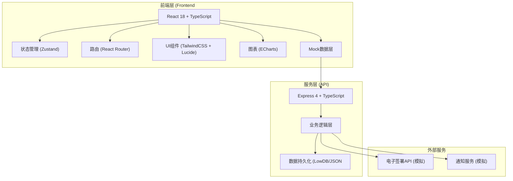
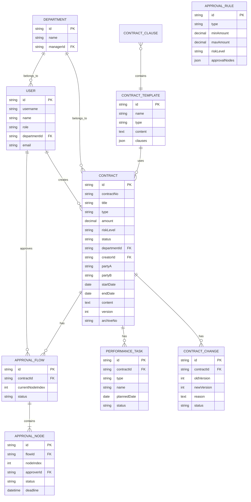

## 1. 架构设计



## 2. 技术描述

- **前端框架**：React 18 + TypeScript
- **构建工具**：Vite 5.x
- **样式方案**：TailwindCSS 3.x
- **状态管理**：Zustand
- **路由管理**：React Router DOM 6.x
- **图表库**：ECharts 5.x
- **图标库**：lucide-react
- **UI组件**：自定义组件 + Radix UI (按需引入)
- **后端框架**：Express 4.x
- **数据持久化**：LowDB (JSON文件存储)
- **项目初始化**：使用 `react-express-ts` 模板
- **包管理器**：npm

## 3. 目录结构

```
/
├── src/                          # 前端源码
│   ├── components/               # 公共组件
│   │   ├── layout/             # 布局组件
│   │   │   ├── Header.tsx
│   │   │   ├── Sidebar.tsx
│   │   │   └── DashboardLayout.tsx
│   │   ├── common/              # 通用组件
│   │   │   ├── Card.tsx
│   │   │   ├── Button.tsx
│   │   │   ├── Table.tsx
│   │   │   ├── StatusBadge.tsx
│   │   │   ├── Modal.tsx
│   │   │   └── Form.tsx
│   │   └── charts/              # 图表组件
│   │       ├── PieChart.tsx
│   │       ├── BarChart.tsx
│   │       └── HeatmapChart.tsx
│   ├── pages/                    # 页面组件
│   │   ├── dashboard/           # 首页大屏
│   │   │   ├── index.tsx
│   │   │   ├── StatCard.tsx
│   │   │   ├── StatusDistribution.tsx
│   │   │   ├── ApprovalRanking.tsx
│   │   │   ├── ExpiryWarning.tsx
│   │   │   └── DepartmentHeatmap.tsx
│   │   ├── contracts/           # 合同管理
│   │   │   ├── List.tsx
│   │   │   ├── Detail.tsx
│   │   │   ├── Create.tsx
│   │   │   ├── FilterBar.tsx
│   │   │   └── TemplateSelector.tsx
│   │   ├── approval/           # 审批中心
│   │   │   ├── Pending.tsx
│   │   │   ├── Approved.tsx
│   │   │   └── ApprovalFlow.tsx
│   │   ├── performance/        # 履约管理
│   │   │   ├── Tasks.tsx
│   │   │   ├── ChangeRequest.tsx
│   │   │   └── Timeline.tsx
│   │   ├── warnings/           # 预警中心
│   │   │   └── index.tsx
│   │   └── settings/           # 系统设置
│   │       ├── Users.tsx
│   │       ├── Templates.tsx
│   │       └── ApprovalRules.tsx
│   ├── hooks/                    # 自定义Hooks
│   │   ├── useContracts.ts
│   │   ├── useApproval.ts
│   │   ├── useDashboard.ts
│   │   └── usePermission.ts
│   ├── store/                    # 状态管理
│   │   ├── useContractStore.ts
│   │   ├── useUserStore.ts
│   │   └── useApprovalStore.ts
│   ├── utils/                    # 工具函数
│   │   ├── date.ts
│   │   ├── format.ts
│   │   ├── permission.ts
│   │   └── export.ts
│   ├── types/                    # TypeScript类型定义
│   │   ├── contract.ts
│   │   ├── approval.ts
│   │   ├── user.ts
│   │   └── common.ts
│   ├── mock/                     # Mock数据
│   │   ├── contracts.ts
│   │   ├── users.ts
│   │   ├── templates.ts
│   │   └── dashboard.ts
│   ├── App.tsx
│   ├── main.tsx
│   └── index.css
├── api/                          # 后端源码
│   ├── src/
│   │   ├── routes/               # API路由
│   │   │   ├── contracts.ts
│   │   │   ├── approval.ts
│   │   │   ├── users.ts
│   │   │   ├── templates.ts
│   │   │   └── dashboard.ts
│   │   ├── services/           # 业务逻辑
│   │   │   ├── contractService.ts
│   │   │   ├── approvalService.ts
│   │   │   ├── templateService.ts
│   │   │   └── notificationService.ts
│   │   ├── db/                 # 数据访问
│   │   │   └── lowdb.ts
│   │   ├── middleware/         # 中间件
│   │   │   ├── auth.ts
│   │   │   └── permission.ts
│   │   └── index.ts
│   └── data/                     # 数据文件
│       └── db.json
├── shared/                       # 前后端共享类型
│   └── types.ts
├── vite.config.ts
├── tailwind.config.js
├── tsconfig.json
└── package.json
```

## 4. 路由定义

| 路由路径 | 页面名称 | 权限要求 |
|-----------|----------|----------|
| /dashboard | 首页大屏 | 所有登录用户 |
| /contracts | 合同列表 | 所有登录用户（按角色过滤数据 |
| /contracts/create | 合同起草 | 合同经办人、部门主管、法务、管理员 |
| /contracts/:id | 合同详情 | 所有登录用户（按角色过滤数据） |
| /approval/pending | 待我审批 | 部门主管、法务、管理员 |
| /approval/approved | 我已审批 | 部门主管、法务、管理员 |
| /performance/tasks | 履约任务 | 合同经办人、部门主管 |
| /performance/changes | 变更申请 | 合同经办人 |
| /warnings | 预警中心 | 所有登录用户（按角色过滤数据） |
| /settings/users | 用户管理 | 管理员 |
| /settings/templates | 模板管理 | 法务、管理员 |
| /settings/rules | 审批规则 | 管理员 |

## 5. API 定义

### 5.1 合同相关接口

```typescript
// 合同类型定义
interface Contract {
  id: string;
  contractNo: string;
  title: string;
  type: 'purchase' | 'sales' | 'service' | 'labor' | 'other';
  amount: number;
  riskLevel: 'low' | 'medium' | 'high';
  status: 'draft' | 'pending_approval' | 'approving' | 'approved' | 'signing' | 'signed' | 'performing' | 'completed' | 'expired' | 'terminated';
  departmentId: string;
  creatorId: string;
  partyA: string;
  partyB: string;
  signDate?: string;
  startDate: string;
  endDate: string;
  content: string;
  templateId?: string;
  version: number;
  archiveNo?: string;
  createdAt: string;
  updatedAt: string;
}

// 获取合同列表
GET /api/contracts?page=1&pageSize=20&type=&department=&status=&startDate=&endDate=
Response: {
  data: Contract[],
  total: number,
  page: number,
  pageSize: number
}

// 获取合同详情
GET /api/contracts/:id
Response: Contract

// 创建合同
POST /api/contracts
Request: {
  title: string,
  type: string,
  amount: number,
  partyA: string,
  partyB: string,
  startDate: string,
  endDate: string,
  content: string,
  templateId?: string
}
Response: Contract

// 更新合同
PUT /api/contracts/:id
Request: Partial<Contract>
Response: Contract

// 提交审批
POST /api/contracts/:id/submit
Response: { success: boolean, approvalId: string }

// 导出合同台账
GET /api/contracts/export?type=&department=&startDate=&endDate=
Response: Excel文件流

// 获取推荐模板
GET /api/contracts/templates/recommend?type=&amount=
Response: {
  templates: Array<{
    id: string,
    name: string,
    matchScore: number,
    riskTips: string[]
  }>
}

// 获取推荐条款
GET /api/contracts/clauses/recommend?type=&content=
Response: {
  clauses: Array<{
    id: string,
    title: string,
    content: string,
    riskLevel: string,
    riskDescription: string
  }>
}
```

### 5.2 审批相关接口

```typescript
interface ApprovalNode {
  id: string;
  contractId: string;
  nodeIndex: number;
  nodeName: string;
  approverId: string;
  approverName: string;
  status: 'pending' | 'approved' | 'rejected' | 'escalated' | 'timeout';
  comment?: string;
  deadline: string;
  approvedAt?: string;
  escalatedTo?: string;
}

interface ApprovalFlow {
  id: string;
  contractId: string;
  nodes: ApprovalNode[];
  currentNodeIndex: number;
  status: 'pending' | 'approving' | 'approved' | 'rejected';
  createdAt: string;
}

// 获取待审批列表
GET /api/approval/pending
Response: ApprovalFlow[]

// 获取已审批列表
GET /api/approval/approved
Response: ApprovalFlow[]

// 审批操作
POST /api/approval/:flowId/approve
Request: {
  nodeId: string,
  action: 'approve' | 'reject',
  comment: string
}
Response: { success: boolean }

// 获取审批流程图
GET /api/approval/flow/:contractId
Response: ApprovalFlow
```

### 5.3 履约相关接口

```typescript
interface PerformanceTask {
  id: string;
  contractId: string;
  type: 'payment' | 'delivery' | 'acceptance' | 'other';
  name: string;
  description: string;
  plannedDate: string;
  actualDate?: string;
  status: 'pending' | 'completed' | 'overdue';
  reminderSent: boolean;
}

interface ContractChange {
  id: string;
  contractId: string;
  oldVersion: number;
  newVersion: number;
  reason: string;
  attachmentUrl?: string;
  status: 'pending' | 'approved' | 'rejected';
  createdAt: string;
}

// 获取履约任务列表
GET /api/performance/tasks?contractId=&status=
Response: PerformanceTask[]

// 标记任务完成
POST /api/performance/tasks/:id/complete
Response: { success: boolean }

// 提交变更申请
POST /api/performance/changes
Request: {
  contractId: string,
  reason: string,
  attachment?: File
}
Response: ContractChange

// 获取变更列表
GET /api/performance/changes?contractId=
Response: ContractChange[]
```

### 5.4 首页大屏接口

```typescript
// 获取大屏统计数据
GET /api/dashboard/stats
Response: {
  totalContracts: number,
  pendingApproval: number,
  performing: number,
  expiringIn30Days: number,
  statusDistribution: Array<{ name: string, value: number }>,
  approvalRanking: Array<{ name: string, count: number, avgHours: number }>,
  departmentHeatmap: Array<{ department: string, amount: number, count: number }>,
  expiryWarnings: Array<{
    contractId: string,
    title: string,
    daysLeft: number,
    amount: number
  }>
}
```

### 5.5 用户和权限接口

```typescript
interface User {
  id: string;
  username: string;
  name: string;
  role: 'operator' | 'manager' | 'legal' | 'admin';
  departmentId: string;
  email: string;
  avatar?: string;
}

// 登录
POST /api/auth/login
Request: { username: string, password: string }
Response: { token: string, user: User }

// 获取当前用户信息
GET /api/auth/me
Response: User

// 用户管理
GET /api/users
POST /api/users
PUT /api/users/:id
DELETE /api/users/:id
```

## 6. 数据模型

### 6.1 ER图



### 6.2 核心数据结构说明

1. **用户表(User)**：存储系统用户信息，包含角色和所属部门
2. **部门表(Department)**：存储企业组织架构
3. **合同表(Contract)**：核心业务主表，存储合同全量信息
4. **合同模板表(ContractTemplate)**：合同模板和条款库
5. **审批流程表(ApprovalFlow)**：审批主流程
6. **审批节点表(ApprovalNode)**：每个审批节点详情
7. **履约任务表(PerformanceTask)**：履约关键节点任务
8. **合同变更表(ContractChange)**：合同变更历史记录
9. **审批规则表(ApprovalRule)**：动态审批规则配置

## 7. 审批规则引擎设计

审批规则根据合同类型、金额范围、风险等级三个维度配置：

| 规则ID | 合同类型 | 金额范围 | 风险等级 | 审批节点 |
|---------|----------|----------|----------|----------|
| 1 | 采购合同 | 0-10万 | 低 | 部门主管 |
| 2 | 采购合同 | 10-50万 | 中 | 部门主管 → 财务主管 |
| 3 | 采购合同 | 50万以上 | 高 | 部门主管 → 财务主管 → 法务 → 总经理 |
| 4 | 销售合同 | 0-50万 | 低 | 部门主管 |
| 5 | 销售合同 | 50万以上 | 中/高 | 部门主管 → 法务 → 总经理 |

## 8. 权限控制矩阵

| 功能模块 | 合同经办人 | 部门主管 | 法务 | 管理员 |
|----------|-----------|---------|------|--------|
| 查看首页 | ✅（仅自己） | ✅（本部门） | ✅（全部） | ✅（全部） |
| 起草合同 | ✅ | ✅ | ✅ | ✅ |
| 编辑合同 | ✅（自己的草稿） | ✅（本部门草稿） | ❌ | ✅ |
| 提交审批 | ✅ | ✅ | ✅ | ✅ |
| 审批合同 | ❌ | ✅（权限内） | ✅ | ✅ |
| 查看审批 | ✅（自己的合同） | ✅（本部门） | ✅ | ✅ |
| 履约管理 | ✅（自己的合同） | ✅（本部门） | ❌ | ✅ |
| 变更申请 | ✅（自己的合同） | ✅（本部门） | ❌ | ✅ |
| 模板管理 | ❌ | ❌ | ✅ | ✅ |
| 用户管理 | ❌ | ❌ | ❌ | ✅ |
| 审批规则 | ❌ | ❌ | ❌ | ✅ |
| 导出报表 | ✅（自己的） | ✅（本部门） | ✅ | ✅ |
