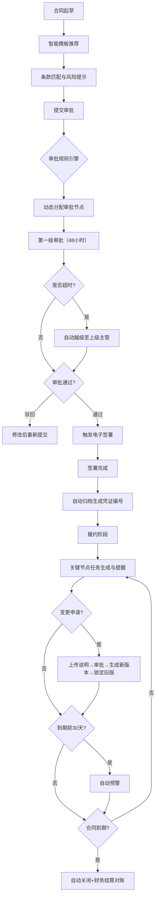

## 1. 产品概述

企业合同全生命周期管理平台，整合合同起草、审批、签署、履约、归档全流程，实现合同管理数字化、智能化。解决传统合同管理中流程不规范、风险管控难、履约跟踪弱、数据统计滞后等问题，提升企业合同管理效率与合规水平。

- **核心价值**：全流程数字化管理、智能风险防控、自动化履约跟踪、实时数据可视化
- **目标用户**：企业合同经办人、部门主管、法务人员、系统管理员

## 2. 核心功能

### 2.1 用户角色

| 角色 | 注册方式 | 核心权限 |
|------|----------|----------|
| 合同经办人 | 管理员创建 | 仅查看和编辑自己负责的合同，发起起草和变更申请 |
| 部门主管 | 管理员创建 | 查看本部门所有合同，审批权限范围内的合同 |
| 法务人员 | 管理员创建 | 风险审批、模板管理、合规审查，查看所有合同 |
| 系统管理员 | 系统预置 | 全局管理，用户权限配置，模板与审批规则调整 |

### 2.2 功能模块

1. **首页大屏**：合同状态分布图、审批效率排行、到期预警数量、部门签约热度
2. **合同管理**：合同起草、模板推荐、条款库、合同列表、详情查看、筛选导出
3. **审批流程**：动态审批节点、限时处理、超时越级、审批记录追踪
4. **电子签署**：签署触发、签署状态跟踪、归档凭证生成
5. **履约管理**：关键节点任务、自动提醒、变更管理、版本控制
6. **预警中心**：到期预警、超时预警、履约异常预警
7. **系统设置**：用户管理、权限配置、模板管理、审批规则配置

### 2.3 页面详情

| 页面名称 | 模块名称 | 功能描述 |
|----------|----------|----------|
| 首页大屏 | 状态概览卡片 | 展示合同总数、待审批、履约中、即将到期等关键指标 |
| 首页大屏 | 合同状态分布图 | 饼图展示各状态合同占比，支持点击筛选 |
| 首页大屏 | 审批效率排行 | 柱状图展示各部门/人员审批效率，显示平均处理时长 |
| 首页大屏 | 到期预警列表 | 展示30天内到期合同，按剩余天数排序 |
| 首页大屏 | 部门签约热度 | 热力图展示各部门签约金额/数量 |
| 合同起草 | 模板选择 | 根据合同类型智能推荐匹配模板，显示匹配度 |
| 合同起草 | 条款推荐 | 基于历史条款库推荐关键条款，显示合规风险提示 |
| 合同起草 | 合同编辑 | 富文本编辑器，支持条款插入、风险标记 |
| 合同列表 | 筛选条件 | 按合同类型、部门、日期、状态组合筛选 |
| 合同列表 | 列表展示 | 显示合同基本信息、状态、当前节点、操作按钮 |
| 合同列表 | 批量操作 | 批量导出、批量归档 |
| 合同详情 | 基本信息 | 展示合同完整信息、版本历史 |
| 合同详情 | 审批流程 | 流程图展示审批节点、处理人、处理时间、意见 |
| 合同详情 | 履约节点 | 时间轴展示付款、交货、验收等关键节点及状态 |
| 合同详情 | 操作记录 | 完整操作日志追踪 |
| 审批中心 | 待我审批 | 展示待处理审批事项，显示剩余处理时间 |
| 审批中心 | 我已审批 | 历史审批记录查询 |
| 审批中心 | 审批操作 | 同意/驳回、填写审批意见、转交他人 |
| 履约中心 | 任务列表 | 展示待处理履约任务，支持标记完成 |
| 履约中心 | 变更申请 | 提交变更说明，上传附件，走审批流程 |
| 预警中心 | 预警列表 | 分类展示到期预警、超时预警、履约异常 |
| 系统设置 | 用户管理 | 用户增删改查、角色分配 |
| 系统设置 | 模板管理 | 合同模板增删改、条款库维护 |
| 系统设置 | 审批规则 | 按金额和风险等级配置审批节点和处理人 |

## 3. 核心流程

### 3.1 合同全生命周期主流程

### 3.2 审批流程说明

1. **动态分配规则**：系统根据合同金额和风险等级自动确定审批节点数量和处理人
2. **限时机制**：每个审批节点限时48小时，倒计时实时显示
3. **越级机制**：超时未处理自动转至上级主管，同时通知原处理人
4. **审批记录**：所有操作留痕，支持追溯

## 4. 用户界面设计

### 4.1 设计风格

- **主色调**：深海蓝 `#1e3a5f`，代表专业、稳重、可信赖
- **辅助色**：
  - 成功绿 `#10b981`，用于已完成、通过状态
  - 警示橙 `#f59e0b`，用于预警、待处理状态
  - 危险红 `#ef4444`，用于风险、驳回、异常状态
  - 信息蓝 `#3b82f6`，用于进行中、待签署状态
- **中性色**：深灰 `#1f2937`、中灰 `#6b7280`、浅灰 `#f3f4f6`、白色 `#ffffff`
- **按钮风格**：圆角6px，扁平化设计，hover时有轻微阴影和颜色加深
- **字体**：
  - 标题："Noto Sans SC"，字重600，大小18-24px
  - 正文："Noto Sans SC"，字重400，大小14px
  - 数据展示："JetBrains Mono"，等宽字体，用于金额、编号展示
- **布局风格**：
  - 顶部导航栏 + 左侧菜单 + 右侧内容区的经典管理后台布局
  - 卡片式信息展示，卡片间间距16px
  - 数据可视化区域采用深色背景大屏风格，与常规操作区形成视觉区分
- **图标风格**：使用Lucide图标库，线性风格，统一16px/20px/24px三种尺寸

### 4.2 页面设计概述

| 页面名称 | 模块名称 | UI元素 |
|----------|----------|---------|
| 首页大屏 | 顶部数据卡片 | 深色渐变背景，发光边框，大号数字，微动效 |
| 首页大屏 | 图表区域 | 深色背景，ECharts图表，5秒刷新动画，数据变化过渡效果 |
| 首页大屏 | 预警列表 | 红色警示图标，倒计时显示，脉冲动画 |
| 合同起草 | 模板推荐区 | 卡片式展示，匹配度百分比进度条，风险标签 |
| 合同起草 | 编辑器区域 | 左右分栏，左侧编辑区，右侧风险提示面板 |
| 合同列表 | 筛选栏 | 多条件组合筛选，快捷筛选标签，重置按钮 |
| 合同列表 | 数据表格 | 斑马纹，hover高亮，状态标签，操作列固定 |
| 审批中心 | 待办卡片 | 显示剩余时间进度条，超时变红，紧急标记 |
| 履约中心 | 时间轴 | 垂直时间轴，节点状态图标，完成进度线 |
| 系统设置 | 配置表单 | 分组展示，开关组件，动态规则配置器 |

### 4.3 响应式设计

- **设计原则**：桌面优先，兼顾平板和大屏展示
- **断点设置**：
  - ≥1440px：标准桌面布局，侧边栏展开
  - 1024-1440px：平板适配，侧边栏可收起
  - <1024px：移动端适配，顶部菜单抽屉式展示
- **大屏优化**：首页大屏支持全屏模式，适合会议室大屏展示
- **触控优化**：按钮最小高度40px，适配触控操作

### 4.4 数据可视化设计

- **图表库**：ECharts 5.x
- **动画效果**：数据加载时的渐入动画，数据刷新时的平滑过渡
- **交互**：支持图表hover显示详情，点击筛选联动
- **大屏风格**：首页采用深色科技感背景，图表配色与主题统一，添加发光效果和网格背景
